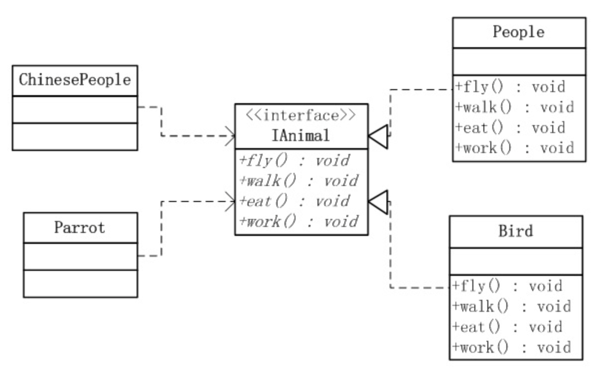
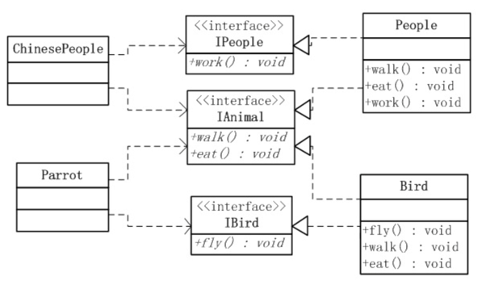
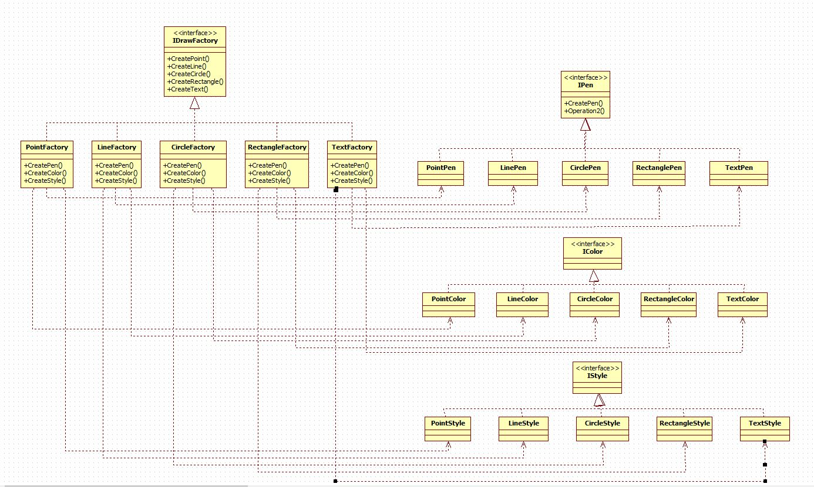
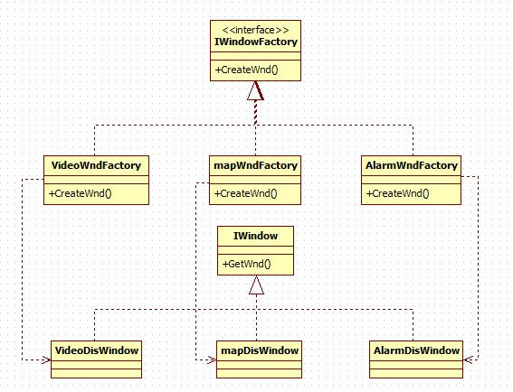
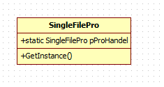
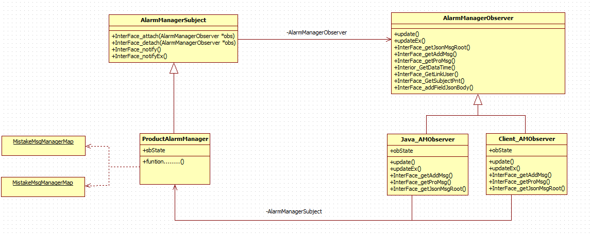
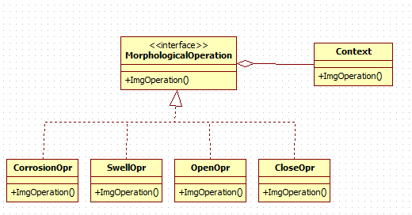

## 设计模式
### 一 设计模式分类
	• 创建型模式（5种）：工厂方法模式，抽象工厂模式，单例模式，建造者模式，原型模式。
	• 结构型模式（7种）：适配器模式，装饰器模式，代理模式，外观模式，桥接模式，组合模式，享元模式。
	• 行为型模式（11种）：策略模式、模板方法模式、观察者模式、迭代子模式、责任链模式、命令模式、备忘录模式、状态模式、访问者模式、中介者模式、解释器模式。
### 二 设计模式遵循的原则
	1、开闭原则（Open Close Principle）
		对扩展开放，对修改关闭。
	2、里氏代换原则（Liskov Substitution Principle）
		只有当衍生类可以替换掉基类，软件单位的功能不受到影响时，基类才能真被复用，而衍生类也能够在基类的基础上增加新的行为。
	3、依赖倒转原则（Dependence Inversion Principle）
		这个是开闭原则的基础，对接口编程，依赖于抽象而不依赖于具体。
	4、接口隔离原则（Interface Segregation Principle）
		使用多个隔离的借口来降低耦合度。
	5、迪米特法则（最少知道原则）（Demeter Principle）
		一个实体应当尽量少的与其他实体之间发生相互作用，使得系统功能模块相对独立。
	6、合成复用原则（Composite Reuse Principle）
		原则是尽量使用合成/聚合的方式，而不是使用继承。继承实际上破坏了类的封装性，超类的方法可能会被子类修改。		
### 设计模式原则之一——开闭原则
##### 定义

__开闭原则（Open Close Principle)__
	   指的是一个软件实体应对扩展开发，对修改关闭(Software entities should be open for extension, but closed for modification)。这个原则是说在设计一个模块的时候，应对使这个模块可以在不被修改的前提下被扩展，换言之，应对可以不必修改源代码的情况下改变这个模块的行为。 
	   根据开闭原则，在设计一个软件系统模块（类，方法）的时候，应该可以在不修改原有的模块（修改关闭）的基础上，能扩展其功能（扩展开放）。
	   
		- 扩展开放：某模块的功能是可扩展的，则该模块是扩展开放的。软件系统的功能上的可扩展性要求模块是扩展开放的。 

		- 修改关闭：某模块被其他模块调用，如果该模块的源代码不允许修改，则该模块修改关闭的。软件系统的功能上的稳定性，持续性要求是修改关闭的。
##### 例子
```java
interface Fruit   
{
 	public void plant();
	public void blossom();
	public void outcome();
}

class Apple implements Fruit   
{
	Apple() { this.plant(); }
	public void plant() { System.out.println("Plant a apple"); };
	public void blossom() { System.out.println("Apple blossomed"); };
	public void outcome() { System.out.println("Apple outcomed"); };
}

interface gardenerBase //Garden,是不能改变的.以后增加一个水果只需要 再写个类继承它!   
{
	public Fruit getFruit();
}

class AppleGardener implements gardenerBase//种植Apple的Garden   
{
	private static AppleGardener singleton;
	private AppleGardener() { ; }
	public static AppleGardener getGardener()
	{
		if (singleton == null)
			singleton  = new AppleGardener();
		return singleton;
	}
	
	public Fruit getFruit()
	{
		return new Apple();
	}
}

public class MyFirstOCPJAVA   
{
	public static void main(String []a)
	{
		Fruit tempApple;
		gardenerBase appleGarden  = AppleGardener.getGardener();
		tempApple  = appleGarden.getFruit();

		Fruit tempPear;
		gardenerBase pearGarden  = PearGardener.getGardener();
		tempPear  = pearGarden.getFruit();
	}
}  
```
### 设计模式原则之二——里氏替换原则
##### 一、定义
__里氏代换原则（Liskov Substitution Principle）__
		所有引用基类的地方必须能透明地使用其子类的对象。	
##### 二、问题由来
		有一功能Fun，由类ClassOrg来完成。现在需要将功能Fun进行扩展，需要新增一子功能，其扩展后的功能为FunEx(FunEx由原有功能Fun和新功能FunSon组成)。功能FunEx由类ClassOrg及其子类ClassSon完成，子类ClassSon在完成新功能FunSon的同时有可能会导致原有功能Fun发生故障。
##### 三、解决方案
		解决：当使用继承时，遵循里氏替换原则。类B继承类A时，除添加新的方法完成新增功能P2外，尽量不要重写父类A的方法，也尽量不要重载父类A的方法。
### 设计模式原则之三——依赖倒转原则
##### 一、定义
		依赖倒转原则（Dependence Inversion Principle）：
		A 高层模块不应该依赖底层模块，都应该依赖于抽象；
		B 抽象不应该依赖于具体，具体依赖于抽象	
##### 二、问题由来
		若高层依赖于底层，那么底层的变动也会导致高层的变动，这就会导致模块的复用性降低而且大大提高了开发的成本。若是依赖于抽象的话，那么是比较稳定的，底层或者高层的变动都不会互相影响。
##### 三、解决方案
**==在项目的开发过程中遵循一个核心思想——“面向接口编程”。==**
###### 知识点：
	• 低层模块：系统不可分割的原子逻辑（会根据业务逻辑经常变化）
	• 高层模块：低层模块的再组合，对低层模块的抽象。
	• 抽象： 接口或抽象类（是底层模块的抽象，特点：不能直接被实例化）
	• 与接口或抽象类对应的实现类：低层模块的具体实现（特点：可以直拉被实例化）


==*在面向对象的编程过程中，要写出低耦合高内聚的代码，需要遵循如下原则： 
	1. 模块间的依赖通过抽象类或接口发生，实现类之间的依赖关系也是通过抽象类或接口产生（实现类之间不应发生直接的依赖关系），降低系统的耦合性 
	2. 接口或抽象不依赖于实现类，但实现类依赖接口或抽象类，实现类对系统需要的功能具体实现，提高类的内聚!*==
###### 经典例子：
		公司是福特和本田公司的金牌合作伙伴，现要求开发一套自动驾驶系统，只要汽车上安装该系统就可以实现无人驾驶，该系统可以在福特和本田车上使用，只要这两个品牌的汽车使用该系统就能实现自动驾驶。
```c++
/*福特汽车类，包含三个方法，启动、停止、转弯*/
class FordCar
{
	public void Run()
	{
		Console.WriteLine("FordCar run");
	}
	
	public void Stop()
	{
		Console.WriteLine("FordCar stop");
	}
	
	public void Turn()
	{
		Console.WriteLine("FordCar turn");
	}
 }
 
 /*宏达汽车类，包含三个方法，启动、停止、转弯*/
class HondaCar
{
	public void Run()
	{
		Console.WriteLine("HondaCar run");
	}
	
	public void Stop()
	{
		Console.WriteLine("HondaCar stop");
	}
	
	public void Turn()
	{
		Console.WriteLine("HondaCar turn");
	}
}

/*自动驾驶系统，有三个方法启动汽车、停止汽车、汽车转向*/
  class AutoSystem
    {
        HondaCar hondaCar = new HondaCar();
        FordCar fordCar = new FordCar();
        CarType type;
        public AutoSystem(CarType type)
        {
            this.type = type;
        }
		
        public void RunCar()
        {
            if (type == CarType.Honda)
            {
                hondaCar.Run();
            }
            else if (type == CarType.Ford)
            {
                fordCar.Run();
            }
        }
		
        public void StopCar()
        {
            if (type == CarType.Honda)
            {
                hondaCar.Stop();
            }
            else if (type == CarType.Ford)
            {
                fordCar.Stop();
            }
        }
		
        public void TurnCar()
        {
            if (type == CarType.Honda)
            {
                hondaCar.Turn();
            }
            else if (type == CarType.Ford)
            {
                fordCar.Turn();
            }
        }
    }
```
		目前来看，是满足需求的，但是随着发展业务也在发展，现在如果发展了伙伴，需要对其他品牌的汽车添加自动驾驶系统，比如红旗、奇瑞等品牌，那么如果沿用以前的方式，就需要去修改AutoSystem了，先增加两个新的品牌汽车的对象，然后在启动汽车、停止汽车、汽车转向中进行修改增加分支语句对不同的品牌来进行判断然后加上各种操作，这样就违背的OCP，而且复杂的分支语句也会容易造成错误，如果以后再继续扩展其他的品牌的话，那么这样的程序肯定是不易于维护的，程序的健壮性是较差的，大大的增加了开发的成本。那么敏感的同学已经看出来，既然不同的汽车品牌之间都拥有相同的行为，那么为什么不定义一个接口呢？现在我们先来定义一个接口，然后将各个品牌的汽车实现这个接口实现，那么在AutoSystem中我们就可以针对定义的接口操作了。
```
/*汽车抽象出来的接口*/
    interface ICar
    {
        void Run();
        void Stop();
        void Turn();
     }
	
	/*自动驾驶系统（高层模块）现在针对的是这个抽象的接口，无论什么汽车，只要实现了ICar接口，就能进行相关的操作。*/
	 class AutoSystem
    {
        ICar car;
		
         public AutoSystem(ICar car)
        {
            this.car = car;
        }
		
         public void RunCar()
        {
            car.Run();
        }
		
         public void StopCar()
        {
            car.Stop();
        }
		
         public void TurnCar()
        {
            car.Turn();
        }
    }
	
	/*福特及宏达汽车类也就是底层模块，实现了ICar接口，现在依赖的是抽象的接口!*/
	 class FordCar : ICar
    {
        public void Run()
        {
            Console.WriteLine("FordCar run");
        }
		
         public void Stop()
        {
            Console.WriteLine("FordCar stop");
        }
		
        public void Turn()
        {
            Console.WriteLine("FordCar turn");
        }
    }

	 class HondaCar : ICar
    {
        public void Run()
        {
            Console.WriteLine("HondaCar run");
        }
		
        public void Stop()
        {
            Console.WriteLine("HondaCar stop");
        }
		
        public void Turn()
        {
            Console.WriteLine("HondaCar turn");
        }
    }

```
		当高层模块依赖底层的时候，那么高层的复用性就较差，就如上例所说的增加汽车品牌种类。如果高层与底层都是依赖于抽象的话，那么高层复用性就较好，因为通过继承象出来的接口实现多态，那么复用的地方就多了，这样的设计无疑是较为稳定的。	
### 设计模式原则之四——接口隔离原则
##### 一、定义
__接口隔离原则（Interface Segregation Principle）：__
	客户端不应该依赖它不需要的接口； 一个类对另一个类的依赖应该建立在最小的接口上。
	
定义包含三层含义：
	• 一个类对另一个类的依赖应该建立在最小的接口上；
	• 一个接口代表一个角色，不应该将不同的角色都交给一个接口，因为这样可能会形成一个臃肿的大接口；
	• 不应该强迫客户依赖它们从来不用的方法。
##### 二、问题由来
		类A通过接口I依赖类B，类C通过接口I依赖类D，如果接口I对于类A和类C来说不是最小接口，而类B和类D必须去实现它们不需要的方法。下面通过一个UML图来说明这种现象：



##### 三、解决方案
		将臃肿的接口IAnimal拆分为独立的几个接口，类ChinesePeople和类Parrot分别与它们需要的接口建立依赖关系，也就是采用接口隔离原则。修改后的UML图如下所示：

				
__使用接口隔离原则，意在设计一个短而小的接口和类__ ,我们常说的高内聚低耦合的设计思想，从而使得类具有很好的可读性、可扩展性和可维护性。
         在项目开发中，依赖几个专用的接口要比依赖一个综合的接口更加灵活。通过分散定义多个接口，可以预防外来变更的扩散，提高系统的灵活性和可维护性。
     虽然接口隔离原则很有意义，但在实际项目中，应该注意度的把握，接口设计的过大或过小都不好，应该根据实际情况多思考再进行设计。
### 设计模式原则之五——迪米特法则
##### 一、定义
__迪米特法则（最少知道原则）（Demeter Principle）：__
		一个软件实体应当尽可能少的与其他实体发生相互作用。每一个软件单位对其他的单位都只有最少的知识，而且局限于那些与本单位密切相关的软件单位。
##### 二、问题由来
		类与类之间的关系越密切，则二者之间的耦合度就越大，也就意味着当一个类发生改变时，对另一个类的影响也越大。
##### 三、解决方案
__尽量降低类与类之间的耦合。__
__.		知识点：__

		我们知道在软件工程中评定一个好的软件设计应该满足的原则是：==低耦合，高内聚==。
		a、软件架构设计的目的：为什么要对一个软件系统做架构设计呢？一个重要的原因就是我们在保持软件内在联系的前提下，对一个大的软件系统做分解和细化，以此来降低软件系统开发的复杂性。而分解软件系统的基本方法无外乎分层和分割。然而分层分割系并不是一件容易的事，根据我们面对的场景和需求的不同出现了多种分层分割系统的方法，比如：关注点分离，面向方面，面向对象，面向接口，面向服务，依赖注入，以及各种各样的设计原则等。
		b、内聚：是从功能角度来度量一个模块的内在联系。一个好的内聚模块应当恰好做一件事。它描述的是模块内的功能联系；所以在分割功能模块的时候应当让模块的功能保持高内聚，每个模块都尽可能只解决一个需求，并把这个需求的功能做的高效、易用。
		c、耦合：度量软件系统中各个模块之间互联程度、依赖强度。耦合强弱取决于模块间接口的复杂程度、进入或访问一个模块的点以及通过接口的数据。
		
		无论是面向过程编程还是面向对象编程，都要尽可能的降低系统中各个模块间的耦合度，才能最大限度的提高代码的复用率，降低需求变更而引起连锁性的系统重构、或者一个模块变更导致多个模块需要同时变更。
	
		怎么样编程才能做到低耦合呢？那正是迪米特法则要去完成的。
		迪米特法则又叫最少知道原则，最早是在1987年由美国Northeastern University的Ian Holland提出。
		通俗的来讲，就是一个类对自己依赖的类知道的越少越好。也就是说，对于被依赖的类来说，无论逻辑多么复杂，都尽量地的将逻辑封装在类的内部，对外除了提供的public方法，不对外泄漏任何信息。也就是说外部对此类访问只能通过public公共方法来访问。
*==__迪米特法则还有一个更简单的定义：只与直接的朋友通信。__==*

		直接的朋友：每个对象都会与其他对象有耦合关系，只要两个对象之间存在耦合关系，才能说这两个对象之间是朋友关系。而耦合的方式很多，依赖、关联、组合、聚合等。其中，我们称出现成员变量、方法参数、方法返回值中的类为直接的朋友，而出现在局部变量中的类则不是直接的朋友。
==__也就是说，陌生的类最好不要作为局部变量的形式出现在类的内部。__==

***==C++例子：==***

		举个例子: 假如有一个需求是打印一个省份下面的所有的县，所有的县都是录属于某一个市。
		新建3个不同的类,Province (省), Town(市), County(县) 
```c++
/*(1).Class Town*/
	class Town
	{
	private:
		int Id;
		string name;
		list<Student> countyList;
	public:
		//设置/获取市的行政代码
		void SetTownId(int id);
		int GetTownId();
	
		//设置/获取市的名称
		void SetTownName(string name);
		string GetTownName();
	
		//设置/获取市下所辖县
		void SetCountyList(list<County> &countesList);
		list<County> GetCountyList();
	
		//打印下设所有县的信息
	          void CountyInfoPrint();
	};
	
/*(2).Class County*/
	class County
	{
	private:
		int Id;
		string name;
	public:
		//设置/获取县的行政代码
		void SetCountyId(int id);
		int GetCountyId();
	
		//设置/获取县的名称
		void SetCountyName(string name);
		string GetCountyName();
	          
		//打印下所属信息
                      void InfoPrint();
	};
	
/*(3).Class Province*/
	class Province
	{
	private:
		int Id;
		string name;
		list<Town> townsList;
	public:
		//设置/获取县的行政代码
		void SetTownId(int id);
		int GetTownId();
	
		//设置/获取县的名称
		void SetTownName(string name);
		string GetTownName();
	
		//设置/获取省下所辖市
		void SetTownList(list<Town> &TownList);
		list<Town> GetTownList();
	
		void CountysPrint();
		/*
			方法一：遍历townsList，再在每一个Town中遍历每一个County，再调用County.InfoPrint();
			
	
			方法二：遍历townsList，调用Town.CountyInfoPrint();
		*/
	};
```
**==分析：==**

*==如果使用方法一，根据迪米特法则，只与直接的类发生通信，显然类并不是School类的直接关系（以局部变量出现的耦合不属于直接关系），现在这个设计的主要问题出在School中，根据迪米特法则，只与直接的类发生通信，而County类并不Province类的直接的朋友（County的对象在CountysPrint()方法中以局部变量出现，County与School发生的的耦合不属于直接关系），从逻辑上讲省只与他的市耦合就行了，而与市下辖的县并没有任何联系，如果使用方法一设计显然是增加了不必要的耦合。按照迪米特法则，应该避免类中出现这样非直接关系的耦合，应该使用方法二。==*		

		迪米特法则的初衷是降低类之间的耦合，降低系统中不同的类之间的依赖关系，就可以降低类间的耦合关系。
		但是凡事都有度，虽然迪米特法则可以避免与非直接的类通信，但是只要两个类间出现数据通信，就必然要通过一个“中介”来发生联系，如果过分的使用迪米特原则，将会产生大量的中介和传递类，会导致系统复杂度变大。所以在采用迪米特法则时要反复权衡，既做到结构清晰，又要高内聚低耦合。
### 设计模式原则之六——合成复用原则
##### 一、定义
__合成复用原则（Composite Reuse Principle）__	
尽量使用对象组合，而不是继承来达到复用的目的。
##### 二、问题由来
		我们都希望封装好的类有良好的复用性，而实现复用的方式有两种：
		1、组合/聚合
		2、继承
		然而我们都知道继承会破坏类的分装性，因而就有了合成复用原则。
##### 三、解决方案
		尽量使用合成/聚合达成复用的目的。
**==知识点	MyBook1:==**

		组合和聚合都是对象建模中关联（Association）关系的一种.
		a、聚合表示整体与部分的关系，表示“含有”，整体由部分组合而成，部分可以脱离整体作为一个独立的个体存在。
		b、组合则是一种更强的聚合，部分组成整体，而且不可分割，部分不能脱离整体而单独存在。
		

		为什么要使用合成复用原则： 	
		. 对象的继承关系在编译时就定义好了，所以无法在运行时改变从父类继承的子类的实现 	
		. 子类的实现和它的父类有非常紧密的依赖关系，以至于父类实现中的任何变化必然会导致子类发生变化
		当你复用子类的时候，如果继承下来的实现不适合解决新的问题，则父类必须重写或者被其它更适合的类所替换
		这种依赖关系限制了灵活性，并最终限制了复用性。*
### 设计模式之抽象工厂模式
##### 一、定义
	为创建一组相关或相互依赖的对象提供一个接口，而且无需指定他们的具体类。	
##### 二、模型

#####  三、解析
**==优点:==**

		当一个产品族中的多个对象被设计成一起工作时，它能保证客户端始终只使用同一个产品族中的对象。
==**缺点：**==

		产品族扩展非常困难，要增加一个系列的某一产品，既要在抽象的 Creator 里加代码，又要在具体的里面加代码。
**==适用环境：==**

		1、某种应用变更的时候，一整套一起换。 
		2、生成不同操作系统的程序。
### 设计模式之工厂方法模式
##### 一、定义
		工厂方法模式（FACTORY METHOD）是一种常用的对象创建型设计模式，此模式的核心精神是封装类中不变的部分，提取其中个性化善变的部分为独立类，通过依赖注入以达到解耦、复用和方便后期维护拓展的目的。它的核心结构有四个角色，分别是抽象工厂；具体工厂；抽象产品；具体产品!
##### 二、模型

#####  三、解析
**==优点:==**

		1、创建客户所需的产品的时候影藏了具体产品类实例化的细节，客户只需关注所需产品对应的工厂。
		2、系统加入新产品时，无须修改抽象工厂和抽象产品提供的接口以及客户端代码，也无须修改其他的具体工厂和具体产品，而只要添加一个具体工厂和具体产品就可以了。
**==缺点：==**

		1、每次添加新产品时，都需要编写新的具体产品类以及对应的具体工厂类，系统中类的个数将成对增加，在一定程度上增加了系统的复杂度，有更多的类需要编译和运行，会给系统带来一些额外的开销。
		2、由于考虑到系统的可扩展性，需要引入抽象层，在客户端代码中均使用抽象层进行定义，增加了系统的抽象性和理解难度，且在实现时可能需要用到DOM、反射等技术，增加了系统的实现难度。
**==适用环境：==**

		一个类不知道它所需要的对象的类：在工厂方法模式中，客户端不需要知道具体产品类的类名，只需要知道所对应的工厂即可，具体的产品对象由具体工厂类创建；客户端需要知道创建具体产品的工厂类。
		一个类通过其子类来指定创建哪个对象：在工厂方法模式中，对于抽象工厂类只需要提供一个创建产品的接口，而由其子类来确定具体要创建的对象，利用面向对象的多态性和里氏代换原则，在程序运行时，子类对象将覆盖父类对象，从而使得系统更容易扩展。
### 设计模式之单例模式
##### 一、定义
		应用该模式的类一个类只有一个实例。即一个类只有一个对象实例。
==单例模式有三种：饿汉式、懒汉式和登记式。==
##### 二、模型

#####  三、解析
**1、饿汉式:**
 ```java
public class SingleFilePro{
	private static SingleFilePro pProHandle = new SingleFilePro();
	private SingleFilePro(){
		
	}
	public static SingleFilePro GetInstance(){
		return pProHandle;
	}
}
```
**==特点：==** 空间换时间
**==优点：==** 执行效率高
**==缺点：==** 类加载时就初始化，浪费内存空间。

**2、懒汉式:**
 ```java
public class SingleFilePro{
	private static SingleFilePro pProHandle =null;
	private SingleFilePro(){
		
	}
	public static synchronized SingleFilePro GetInstance(){
		If(null == pProHandle){
			pProHandle = new SingleFilePro();
		}
		return pProHandle;
	}
}
```
**==特点：==** 时间换空间
**==优点：==** 第一次调用的时候才会初始化，避免内存浪费
**==缺点：==** 必须加锁synchronized 才能保证单例，加锁会影响效率

**3、登记式:**
 ```java
public class SingleFilePro{
	private static SingleFilePro pProHandle =null;
	private SingleFilePro(){
		
	}
	public static synchronized SingleFilePro GetInstance(){
		return Hoder pProHandle;
	}
	
	private static class Hoder{
		private static final SingleFilePro pProHandle =  new SingleFilePro();
	}
}
```
**==特点：==** 具备前面二者的优点，是最好的单例模式。
### 设计模式之观察者模式
##### 一、定义
		定义对象间的一种一对多的依赖关系，当一个对象的状态发生改变时，所有依赖于它的对象都得到通知并被自动更新。
##### 二、模型

#####  三、解析
**==优点：==** 

		1、观察者和被观察者是抽象耦合的。 
		2、建立一套触发机制。
**==缺点：==**

		1、如果一个被观察者对象有很多的直接和间接的观察者的话，将所有的观察者都通知到会花费很多时间。
		2、如果在观察者和观察目标之间有循环依赖的话，观察目标会触发它们之间进行循环调用，可能导致系统崩溃。
		3、观察者模式没有相应的机制让观察者知道所观察的目标对象是怎么发生变化的，而仅仅只是知道观察目标发生了变化。
**==使用场景：==**

		• 一个抽象模型有两个方面，其中一个方面依赖于另一个方面。将这些方面封装在独立的对象中使它们可以各自独立地改变和复用。
		• 一个对象的改变将导致其他一个或多个对象也发生改变，而不知道具体有多少对象将发生改变，可以降低对象之间的耦合度。
		• 一个对象必须通知其他对象，而并不知道这些对象是谁。
		• 需要在系统中创建一个触发链，A对象的行为将影响B对象，B对象的行为将影响C对象……，可以使用观察者模式创建一种链式触发机制。
**==例子：==**

```c++
/*ProductAlarmManager*/
//ProductAlarmManager.h
/*********************************************************************************************
Copyright (C), ....-...., ... Technology Co.,Ltd.
File name:	   ModelWndInterface.h
Author:		   CUIJIANHUA R&D Department.
Version:	   V1.2.0.0_linux
Date:		   2018-06-07
Description:   linux Background logic layer------Alarm message management class
namespace:     
Others:		 ... Co.,Ltd. All rights reserved.
**********************************************************************************************/
#ifndef LINUX_SEVER_ALARMERS_MANAGER_DEFINE_2018_06_07
#define LINUX_SEVER_ALARMERS_MANAGER_DEFINE_2018_06_07
#pragma once
#include "AbstractProduct.h"
#include "../DealJosnMsg.h"
#include <iostream>
#include <string>
#include <list>
#include <map>
#include <vector>
#include "../ClientMsgBroadcast/BaseClientMsgBroadcast.h"
#include "../threadPool/threadpool.hpp"
#include "../BusinessProcess/FactoryManage.h"
//#include "../BusinessProcess/AbstractProduct.h"

//#define _LINUX_
#if defined _WIN32

#else		
#include <pthread.h>
#endif

using namespace std;

const bool bIsPrintDebugInfoToScreen = false;//The flags with the debug information Whether to print  
const bool bIsPrintDebugInfoTobkFile = true;//The flags with the debug information Whether to print 

const int ADD_NEW_ALARM_MSG_TO_JAVA = 30000;
const int PRO_THE_ALARM_MSG_TO_JAVA = 30200;
const string ADD_NEW_ALARM_MSG_TO_CLIENT = "newAlarm";
const string PRO_THE_ALARM_MSG_TO_CLIENT = "proAlarm";

#ifndef __ALARMER_INFO_RES__
#define __ALARMER_INFO_RES__
/* struct->CAlarmMsgInfo is alarm mag infomations*/
typedef enum _CAlarmState
{
	ALARM_PRO_STATE_NOPRO = 000,//未处理
	ALARM_PRO_STATE_TRACK = 001,//已追踪
	ALARM_PRO_STATE_FALSE = 002,//误告警
}CAlarmState;

typedef struct _AlarmerInfoRes
{
	string	personName;		//识别的人物名字
	int 	personID;		//人物ID（预留，以后跨相机识别可能会用到）
	int		alarmID;		//报警ID
	int		age;			//识别年龄
	int		gender;			//识别性别
	int		camID;			//报警的相机ID
	int		firstWarnTime;	//报警等级
	float	similarity;		//报警时间（时间戳-毫秒）
	int		warnDegree;		//相似度
	float	belief;			//置信度
	string	imgID;			//抓拍图片ID
	string	libPhotoUrl;	//底图路径
	int     faceLibID;
	string	capPhotoUrl;	//抓拍图路径
	string	feaUrl;			//人脸特征文件路径
	CAlarmState proStatus;       //处理状态
	string  proHuman;       //处理人员
	_AlarmerInfoRes()
	{
		personID = 0;
		alarmID = 0;
		age = 0;
		gender = -1;
		camID = 0;
		firstWarnTime = 0;
		warnDegree = -1;
		similarity = 0.0;
		belief = 0.0;
		personName = "";
		imgID = "";
		libPhotoUrl = "";
		faceLibID = -1;
		capPhotoUrl = "";
		feaUrl = "";
		proStatus = ALARM_PRO_STATE_NOPRO;
		proHuman = "";
	}
}AlarmerInfoRes;
#endif


/*<BGN-------------------------------------------------Struct define---------------------------------------------------->*/

typedef struct _LinkUser
{
	string cIpAddress;  //user IP address
	int nPort;          //user port
	_LinkUser()
	{
		cIpAddress = "";
		nPort = -1;
	}
}LinkUser;
inline LinkUser Build_LinkUser(string ip, int port)
{
	LinkUser user;
	user.cIpAddress = ip;
	user.nPort = port;
	return user;
}

/* struct->CAlarmMsgInfo is alarl msg*/
typedef struct _CAlarmMsgInfo
{
	int nAlarmPrsnId;       //alarmer ID
	int nFaceLibId;         //Bottom gallery ID
	string sLibImgId;       //base map ID
	int nAlarmCamId;        //alarm camera ID
	string sHumanProName;   //handling person name
	CAlarmState statePro;   //handling state 0 
	int64_t lStartTime;   //alarm start time
	long nMsgAging;         //News limitation
	int nAlarmGrade;        //alarm grade
	_CAlarmMsgInfo()
	{
		nAlarmPrsnId = 0;
		nFaceLibId = 0;
		sLibImgId = "";
		nAlarmCamId = 0;
		sHumanProName = "";
		statePro = ALARM_PRO_STATE_NOPRO;
		lStartTime = 0;
		nMsgAging = 0;
		nAlarmGrade = 0;
	}
}CAlarmMsgInfo;
inline CAlarmMsgInfo Build_AlarmMsgInfo(int nAlarmPrsnId, int nFaceLibId, string sLibImgId, int nAlarmCamId, long long lStartTime, long nMsgAging, int nAlarmGrade, string sHumanName = "", CAlarmState statePro = ALARM_PRO_STATE_NOPRO)
{
	CAlarmMsgInfo info;
	info.nAlarmPrsnId = nAlarmPrsnId;
	info.nFaceLibId = nFaceLibId;
	info.sLibImgId = sLibImgId;
	info.nAlarmCamId = nAlarmCamId;
	info.sHumanProName = sHumanName;
	info.statePro = statePro;
	info.lStartTime = lStartTime;
	info.nMsgAging = nMsgAging;
	info.nAlarmGrade = nAlarmGrade;
	return info;
};

/* struct->CAlarmMsgInfo is alarm mag infomations*/
typedef struct _CMistakenAccusatn
{
	int nAlarmPrsnId;       //alarmer ID
	int64_t lStartTime;   //alarm start time
	long nMisAging;         //mistaken accusation limitation
	_CMistakenAccusatn()
	{
		nAlarmPrsnId = 0;
		lStartTime = 0;
		nMisAging = 0;
	}
}CMistakenAccusatn;
inline CMistakenAccusatn Build_MistakenAccusatn(int nAlarmPrsnId, long long lStartTime, long nMisAging)
{
	CMistakenAccusatn info;
	info.nAlarmPrsnId = nAlarmPrsnId;
	info.lStartTime = lStartTime;
	info.nMisAging = nMisAging;
	return info;
};
/* struct->CAlarmMsgAlterObj is alarm mag which object while be altered*/
typedef enum _CAlarmMsgAlterObj
{
	ALTER_MSG_PRO_INFO = 0X001, //alter alarmMsg's process info
	ALTER_MSG_CAM_INFO = 0X002, //alter alarmMsg's camera info
}CAlarmMsgAlterObj;

/*struct->alarm msg action*/
typedef enum _CAlarmMsgProAction
{
	MSG_ACTION_NULL = 0X0000, //no action
	MSG_ACTION_ADD_NEW_ALARM = 0X0001, //Add a new alarm
	MSG_ACTION_PROCESSED_ALARM = 0X0002, //The alarm is handled
	MSG_ACTION_ANOTHER_CAM_FIND_ALARM = 0X0003, //The alarm appeared in another camera
}CAlarmMsgProAction;

/*struct->alarm msg action*/
typedef enum _CMsgType
{
	MSG_TYPE_TO_JAVA = 0X0000, 
	MSG_TYPE_TO_CLIENT = 0X0001,
}CMsgType;

/* struct->CAlarmerPro is pro msg*/
typedef struct _CAlarmerPro
{
	int nAlarmPrsnId;       //alarmer ID
	int nProState;       //处理状态
	string  sProHuman;       //处理人员
	int64_t lStartTime;   //alarm start time
	_CAlarmerPro()
	{
		nAlarmPrsnId = 0;
		nProState = ALARM_PRO_STATE_NOPRO;
		sProHuman = "";
		lStartTime = 0;
	}
}CAlarmerPro;
inline CAlarmerPro Build_AlarmerPro(int nAlarmPrsnId, int nProState, string  sProHuman, long long lStartTime)
{
	CAlarmerPro info;
	info.nAlarmPrsnId = nAlarmPrsnId;
	info.nProState = nProState;
	info.sProHuman = sProHuman;
	info.lStartTime = lStartTime;
	return info;
};

/* struct->InterFaceWndError is state code*/
typedef enum _AMError
{
	ALARM_MANAGER_SUCCEED = 0X001,//succeed
	ALARM_MANAGER_ERROR_ATTACH_OBSEVER = -0X0001, //attach a obsever is filled
	ALARM_MANAGER_ERROR_DETACH_OBSEVER = -0X0002, //detach a obsever is filled
	ALARM_MANAGER_ERROR_MSG_NOT_EXIST_INT_MAP = -0X0002, //alarm is not exist in the map
	ALARM_MANAGER_ERROR_MSG_HAD_EXIST_INT_MAP = -0X0003, //alarm is had existed in the map
	ALARM_MANAGER_ERROR_QUEUE_PNT_IS_NULL = -0X0004, //queue pnt is null
}AMError;
/*<END-------------------------------------------------Struct define---------------------------------------------------->*/


class AlarmManagerSubject;

/*<BGN------------------------------------------------AlarmManagerObserver----------------------------------------------->*/
/*class->Abstract Observer*/
//告警消息观察者，由于有多个都需要获取告警消息（java端，跟踪逻辑层，客户端等），定义为虚类，实现在子类中
//当观察的目标发生改变时获得通知
class AlarmManagerObserver
{
public:
	AlarmManagerObserver(LinkUser user, AlarmManagerSubject *sub);
	AlarmManagerObserver(AlarmManagerSubject *sub);
	virtual AMError update() = 0;
	virtual AMError updateEx() = 0;

	/*////////////////////////////////interface specifier////////////////////////////////*/
	/**
	*-> &function  Get msg json msg head
	*-> @param
	*-> #return    AMError: state
	/*/
	virtual void InterFace_getJsonMsgRoot(Json::Value &JsonRoot, int msgCode);
	virtual void InterFace_getJsonMsgRoot(Json::Value &JsonRoot, string code);

	/*////////////////////////////////interface specifier////////////////////////////////*/
	/**
	*-> &function  Add new alarm
	*-> @param     alarmInfo::alarm info
	*-> @param     newCam::newCam(if not = -1)
	*-> @param     proState::proState
	*-> @param     proHuman::proHuman
	*-> #return    AMError: state
	/*/
	virtual void InterFace_getAddMsg(Json::Value &msg, AlarmerInfoRes alarmInfo, int newCam = -1)=0;

	/*////////////////////////////////interface specifier////////////////////////////////*/
	/**
	*-> &function  pro alarm msg
	*-> @param     personID::alarm person
	*-> @param     proStaff::pro human
	*-> @param     proState::proState

	*-> #return    AMError: state
	/*/
	virtual void InterFace_getProMsg(Json::Value &msg, CAlarmerPro proInfo)=0;
	virtual void SetBroadcast(void *param)=0 ;
protected:


	/*////////////////////////////////interface specifier////////////////////////////////*/
	/**
	*-> &function  Get Subject's pointer
	*-> @param
	*-> #return
	/*/
	AlarmManagerSubject* InterFace_GetSubjectPnt();

	/*////////////////////////////////interface specifier////////////////////////////////*/
	/**
	*-> &function  Get sys time
	*-> @param
	*-> #return    long long: time
	/*/
	long long Interior_GetDataTime();

	///*////////////////////////////////interface specifier////////////////////////////////*/
	///**
	//*-> &function  Get msg json msg head
	//*-> @param
	//*-> #return    AMError: state
	///*/
	void InterFace_addFieldJsonBody(Json::Value &JsonRoot, char* key, CMsgType type = MSG_TYPE_TO_CLIENT);
	template<typename IdType>
	void InterFace_addFieldJsonBody(Json::Value &JsonRoot, char* key, IdType dataValue, CMsgType type = MSG_TYPE_TO_CLIENT)
	{
		if (MSG_TYPE_TO_JAVA == type)
		{
			JsonRoot["msgBody"]["dataPush"][key] = dataValue;

		}
		else
		{
			JsonRoot["msgBody"]["data"][key] = dataValue;
		}

	}

	template<typename IdType>
	void InterFace_addFieldJsonBody(Json::Value &JsonRoot, char* parentKey, char* key, IdType dataValue, CMsgType type = MSG_TYPE_TO_CLIENT)
	{
		if (MSG_TYPE_TO_JAVA == type)
		{
			JsonRoot["msgBody"]["dataPush"][parentKey][key] = dataValue;
		}
		else
		{
			JsonRoot["msgBody"]["data"][parentKey][key] = dataValue;
		}

	}
	/*void InterFace_addFieldJsonBody(Json::Value &JsonRoot, char* key, string dataValue, CMsgType type = MSG_TYPE_TO_CLIENT);
	void InterFace_addFieldJsonBody(Json::Value &JsonRoot, char* key, string dataValue, CMsgType type = MSG_TYPE_TO_CLIENT);
	void InterFace_addFieldJsonBody(Json::Value &JsonRoot, char* key, int dataValue, CMsgType type = MSG_TYPE_TO_CLIENT);
	void InterFace_addFieldJsonBody(Json::Value &JsonRoot, char* key, float dataValue, CMsgType type = MSG_TYPE_TO_CLIENT);

	void InterFace_addFieldJsonBody(Json::Value &JsonRoot, char* parentKey, char* key, string dataValue, CMsgType type = MSG_TYPE_TO_CLIENT);
	void InterFace_addFieldJsonBody(Json::Value &JsonRoot, char* parentKey, char* key, int dataValue, CMsgType type = MSG_TYPE_TO_CLIENT);
	void InterFace_addFieldJsonBody(Json::Value &JsonRoot, char* parentKey, char* key, float dataValue, CMsgType type = MSG_TYPE_TO_CLIENT);*/

protected:
	LinkUser pUser; //Message receiver address
	AlarmManagerSubject *pSub; //Abstract notifier
public:
	/*////////////////////////////////interface specifier////////////////////////////////*/
	/**
	*-> &function  Get user's address
	*-> @param
	*-> #return
	/*/
	LinkUser InterFace_GetLinkUser();

	boost::threadpool::pool *tp;
	ObjectFactory<std::string, AbstractProduct> factorys; // 对象工厂 
	std::map<std::string, BaseAiServerManage * > *mapWorker;	//底层工人*m_worker;
};
/*<END------------------------------------------------AlarmManagerObserver----------------------------------------------->*/


/*<BGN-----------------------------------------------AlarmManagerSubject------------------------------------------------>*/
/*class->Abstract notifier*/
//告警消息抽象目标，多个观察者观察这个目标，接收告警消息
//提供注册和删除观察者对象的接口
class AlarmManagerSubject
{
public:
	/*////////////////////////////////interface specifier////////////////////////////////*/
	/**
	*-> &function  Register an observer
	*-> @param     obs: the observer to be registered
	*-> #return    AMError: state		   
	/*/
	//virtual AMError InterFace_attach(AlarmManagerObserver *obs) = 0;

	/*////////////////////////////////interface specifier////////////////////////////////*/
	/**
	*-> &function  Log off an observer
	*-> @param     obs: the observer to be logged out
	*-> #return    AMError: state
	/*/
	//virtual AMError InterFace_detach(AlarmManagerObserver *obs) = 0;

	/*////////////////////////////////interface specifier////////////////////////////////*/
	/**
	*-> &function  Alarm Message notify
	*-> @param
	*-> #return    AMError: state
	/*/
	virtual AMError InterFace_notify()=0 ;
	virtual AMError InterFace_notifyEx()=0 ;

	///*////////////////////////////////interface specifier////////////////////////////////*/
	///**
	//*-> &function  Get msg json msg head
	//*-> @param
	//*-> #return    AMError: state
	///*/
	//virtual void InterFace_getJsonMsgRoot(Json::Value & JsonRoot, int type) = 0;
public:
	CAlarmMsgProAction pAction; //action

	AlarmerInfoRes pNewAlarmMsg;  //new alarm msg
	CAlarmerPro    pProAlarmMsg;    //new pro msg
	//Json::Value pToJavaJsonMsg; //msg
	//Json::Value pToClientJsonMsg; //msg
	//Json::Value pToJavaJsonPro; //msg
	//Json::Value pToClientJsonPro; //msg
protected:
	list<AlarmManagerObserver*> pObservers; //Abstract Observer list  保存所有已注册的观察者
};
/*<END-----------------------------------------------AlarmManagerSubject------------------------------------------------>*/


/*<BGN-----------------------------------------------ProductAlarmManager------------------------------------------------>*/
/*class->Specific notifier*/
//告警消息具体目标，当状态发生改变时向它的各个观察者发出通知
class ProductAlarmManager : public AlarmManagerSubject
{
public:
	ProductAlarmManager();
	virtual ~ProductAlarmManager();
private:
	/*////////////////////////////////interface specifier////////////////////////////////*/
	/**
	*-> &function  Clear Observer list
	*-> @param     
	*-> #return    
	/*/
	void Interior_ClearObsList();  //清除所有观察者

	/*////////////////////////////////interface specifier////////////////////////////////*/
	/**
	*-> &function  set msg/mistakeMsg Invalid time
	*-> @param     exprtnTime: Message expiration time
	*-> #return
	/*/
	void Interior_SetMsgInvalidTime(long exprtnTime);
	void Interior_SetMisInvalidTime(long exprtnTime);

	/*////////////////////////////////interface specifier////////////////////////////////*/
	/**
	*-> &function  set msgMap polling time
	*-> @param     exprtnTime: Message polling time
	*-> #return
	/*/
	void Interior_SetMsgPollingTime(int exprtnTime);

	/*////////////////////////////////interface specifier////////////////////////////////*/
	/**
	*-> &function  Get sys time
	*-> @param     
	*-> #return    long long: time
	/*/
	long long Interior_GetDataTime();
//protected:
public:
	/*////////////////////////////////interface specifier////////////////////////////////*/
	/**
	*-> &function  Register an observer
	*-> @param     obs: the observer to be registered
	*-> #return    AMError: state
	/*/
	AMError Interior_Attach(AlarmManagerObserver *obs);//注册观察者

	/*////////////////////////////////interface specifier////////////////////////////////*/
	/**
	*-> &function  Log off an observer
	*-> @param     obs: the observer to be logged out
	*-> #return    AMError: state
	/*/
	AMError Interior_Detach(AlarmManagerObserver *obs);//注销观察者
	/*////////////////////////////////interface specifier////////////////////////////////*/
	/**
	*-> &function  Alarm Message notify
	*-> @param
	*-> #return    AMError: state
	/*/
	AMError InterFace_notify();//通知所有观察者列表中的观察者对象更新
	AMError InterFace_notifyEx();

public:
	/*////////////////////////////////interface specifier////////////////////////////////*/
	/**
	*-> &function  set action
	*-> @param1    action: action
	*-> #return    AMError: state
	/*/
	AMError InterFace_SetAction(CAlarmMsgProAction action);

	/*////////////////////////////////interface specifier////////////////////////////////*/
	/**
	*-> &function  set msg
	*-> @param1    msg: msg
	*-> #return    AMError: state
	/*/
	AMError InterFace_SetAddNewMsg(AlarmerInfoRes msg);
	AMError InterFace_SetProTheMsg(CAlarmerPro msg);

	/*////////////////////////////////interface specifier////////////////////////////////*/
	/**
	*-> &function  Add a new alarm message to msg map
	*-> @param1    nPersonId: The alarmMsg's alarmr's ID
	*-> @param2    info: The alarm message's info
	*-> #return    AMError: state
	/*/
	AMError InterFace_AddNewAlarmMsg(int nPersonId, AlarmerInfoRes info);

	/*////////////////////////////////interface specifier////////////////////////////////*/
	/**
	*-> &function  Delete all lose efficacy alarm message from msg map
	*-> @param    
	*-> #return    AMError: state
	/*/
	AMError InterFace_DeleteLoseEffcAlarmMsg();

	/*////////////////////////////////interface specifier////////////////////////////////*/
	/**
	*-> &function  Surch alarm message which nAlarmPrsnId = nPersonId whether existed in map
	*-> @param     nPersonId: The alarmMsg's id
	*-> #return    bool
	/*/
	bool InterFace_SurchAlarmMsgbIsExist(int nPersonId);


	/*////////////////////////////////interface specifier////////////////////////////////*/
	/**
	*-> &function  Modify the content of an alarm message
	*-> @param1    personId: The alarmMsg's id which while be alter  
	*-> @param2    sProHuman: The name of the person which processing the message
	*-> @param3    info: The alarm message's new info
	*-> @param4    alterObj: The alarmMsg's obj which while be alter
	*-> #return    AMError: state
	/*/
	AMError InterFace_ModifyAlarmMsg(int nPersonId, string sProHuman, CAlarmState state, AlarmerInfoRes* info, CAlarmMsgAlterObj alterObj);

	/*////////////////////////////////interface specifier////////////////////////////////*/
	/**
	*-> &function  Add a new alarm message to msg map
	*-> @param1    nPersonId: The alarmMsg's alarmr's ID
	*-> @param2    info: The alarm message's info
	*-> #return    AMError: state
	/*/
	AMError InterFace_AddNewMisAlarmMsg(int nPersonId, CMistakenAccusatn info);

	/*////////////////////////////////interface specifier////////////////////////////////*/
	/**
	*-> &function  Delete all lose efficacy alarm message from msg map
	*-> @param
	*-> #return    AMError: state
	/*/
	AMError InterFace_DeleteLoseEffcMisAlarmMsg();

	/*////////////////////////////////interface specifier////////////////////////////////*/
	/**
	*-> &function  Surch mistake alarm message which nAlarmPrsnId = nPersonId whether existed in map
	*-> @param     nPersonId: The alarmMsg's id
	*-> #return    bool
	/*/
	bool InterFace_SurchMisAlarmMsgbIsExist(int nPersonId);

	/*////////////////////////////////interface specifier////////////////////////////////*/
	/**
	*-> &function  Get thread close mark
	*-> @param   
	*-> #return    bool
	/*/
	bool InterFace_GetCloseMark();

	/*////////////////////////////////interface specifier////////////////////////////////*/
	/**
	*-> &function  Get cross-camera warning signs
	*-> @param
	*-> #return    bool
	/*/
	bool InterFace_GetCrossCamMark();

	/*////////////////////////////////interface specifier////////////////////////////////*/
	/**
	*-> &function  Get thread close mark
	*-> @param1    nPersonId: alarm key
	*-> @param2    info: alarm info
	*-> #return    bool:sta
	/*/
	AMError InterFace_GetAlarmMsgInfo(int nPersonId, CAlarmMsgInfo & info);

	/*////////////////////////////////interface specifier////////////////////////////////*/
	/**
	*-> &function  Get msgMap polling time
	*-> @param     
	*-> #return    int
	/*/
	int InterFace_GetPollingTime();

	/*////////////////////////////////interface specifier////////////////////////////////*/
	/**
	*-> &function  Set Common Queue address
	*-> @param
	*-> #return    AMError
	/*/
	AMError InterFace_SetAlarmMsgQueuePnt(ThreadSafeDeque<AlarmerInfoRes>* pnt);
	AMError InterFace_SetAlarmMsgQueuePnt(ThreadSafeDeque<string>* pnt);


public:
	/**
	*-> &function  poll alarmlist check msg, delete Invalid msg
	*-> @param
	*-> #return
	/*/
	void InterFace_PollMsgIsInvalid();

	/*////////////////////////////////interface specifier////////////////////////////////*/
	/**
	*-> &function  Get alarm msg From AlarmdequeManage's Queue
	*-> @param  pThis
	*-> #return
	/*/
	void InterFace_GetMsgFromNewMsgQueue();

	/*////////////////////////////////interface specifier////////////////////////////////*/
	/**
	*-> &function  Get alarm msg From AlarmdequePro's Queue
	*-> @param  pThis
	*-> #return
	/*/
	void InterFace_GetMsgFromProMsgQueue();

	/*////////////////////////////////interface specifier////////////////////////////////*/
	/**
	*-> &function  加锁
	*-> @param  nLockID   msg:1  mis:2
	*-> @param  isLock   true:上锁  false:解锁
	*-> #return
	/*/
	void Interior_EnableLock(int nLockID,bool isLock);
private:
	map<int, CAlarmMsgInfo> m_alarmMap; //the map of the Alarm message management
	map<int, CMistakenAccusatn> m_misMap; //the map of the mistake Alarm message management
	long m_lMsgExprtnTime;  //alarm msg  time limit
	long m_lMisExprtnTime;  //Mistake alarm msg time limit
	int  m_nPollingTime;    //alarm msg aging polling time
	bool m_bIsCloseThread;  //the thread close mark
	bool m_bAcrossCamAlarm; //the mark whether alarm when alarmer across a new cam
#if defined _LINUX_	
	pthread_rwlock_t* m_rwMsgMapLock;//res rwLock;
	pthread_rwlock_t* m_rwMisMapLock;//res rwLock;
	
#endif
#if defined _WIN32
		SRWLOCK   m_rwMsgMapLockEx;
		SRWLOCK	  m_rwMisMapLockEx;
#endif
public:
	ThreadSafeDeque<AlarmerInfoRes>* m_alarmMsgDeque;
	ThreadSafeDeque<string>* m_alarmProDeque;
};
/*<END-----------------------------------------------ProductAlarmManager------------------------------------------------>*/
#endif  //LINUX_SEVER_ALARMERS_MANAGER_DEFINE_2018_06_07

/*ProductAlarmManager.cpp*/
#include "ProductAlarmManager.h"
#include <boost/atomic.hpp>
#include "../commonData.h"
#include "../DealJosnMsg.h"
#include "../BaseStruct.h"
#include "../CommonDefine.h"
#include "../commonData.h"
#include <thread>
#include <boost/functional/factory.hpp> 
#if defined _WIN32
#include <time.h>
#include <windows.h> 
#include <sys/timeb.h>
#else
#include <sys/time.h>
#endif
/*<BGN----------------------------------------------------------------AlarmManagerObserver--------------------------------------------------------------->*/
/*||||||||||||||||||||||||||||||||||||||||||||||||||||||||||||||||||||||||||||||||||||||||||||||||||||||||||||||||||||||||||
Creation  Date: 2018-06-07
Ambition _date: 2018-06-07
Modified _date:
Modify content:
Modify __staff: Janhua.Cui
*/
AlarmManagerObserver::AlarmManagerObserver(LinkUser user, AlarmManagerSubject *sub)
{
	this->pUser = user;
	this->pSub = sub;
}
AlarmManagerObserver::AlarmManagerObserver(AlarmManagerSubject *sub)
{
	this->pSub = sub;
}

/*||||||||||||||||||||||||||||||||||||||||||||||||||||||||||||||||||||||||||||||||||||||||||||||||||||||||||||||||||||||||||
Creation  Date: 2018-06-07
Ambition _date: 2018-06-07
Modified _date:
Modify content:
Modify __staff: Janhua.Cui
*/
LinkUser AlarmManagerObserver::InterFace_GetLinkUser()
{
	return this->pUser;
}

/*||||||||||||||||||||||||||||||||||||||||||||||||||||||||||||||||||||||||||||||||||||||||||||||||||||||||||||||||||||||||||
Creation  Date: 2018-06-07
Ambition _date: 2018-06-07
Modified _date:
Modify content:
Modify __staff: Janhua.Cui
*/
AlarmManagerSubject* AlarmManagerObserver::InterFace_GetSubjectPnt()
{
	return this->pSub;
}
void AlarmManagerObserver::InterFace_getJsonMsgRoot(Json::Value &JsonRoot, int msgCode)
{
	return;
}
void AlarmManagerObserver::InterFace_getJsonMsgRoot(Json::Value &JsonRoot, string msgCode)
{
	return;
}
/*||||||||||||||||||||||||||||||||||||||||||||||||||||||||||||||||||||||||||||||||||||||||||||||||||||||||||||||||||||||||||
Creation  Date: 2018-06-08
Ambition _date: 2018-06-08
Modified _date:
Modify content:
Modify __staff: Janhua.Cui
*/
long long AlarmManagerObserver::Interior_GetDataTime()
{
	struct timeval subTimeStruct;
#if defined WIN32
	struct timeb tp;
	uint64_t Time;

	ftime(&tp);
	subTimeStruct.tv_sec = tp.time;
	subTimeStruct.tv_usec = tp.millitm;
#else		
	gettimeofday(&subTimeStruct, NULL);
#endif
	long long nTime = (long long)(subTimeStruct.tv_sec * 1000 + subTimeStruct.tv_usec);
	return nTime;
}
void AlarmManagerObserver::InterFace_addFieldJsonBody(Json::Value &JsonRoot, char* key, CMsgType type)
{
	if (MSG_TYPE_TO_JAVA == type)
	{
		JsonRoot["msgBody"]["dataPush"][key] = {};
	}
	else
	{
		JsonRoot["msgBody"]["data"][key] = {};
	}
}
/*<BGN----------------------------------------------------------------ProductAlarmManager---------------------------------------------------------------->*/
ProductAlarmManager::ProductAlarmManager()
{
	pAction = MSG_ACTION_NULL;
	pObservers.clear();
	m_lMsgExprtnTime = 300000;//ms
	m_lMisExprtnTime = 86400000;//ms
	m_bAcrossCamAlarm = false;
	m_nPollingTime = 300;//s
	m_bIsCloseThread = false;
	m_alarmMsgDeque = NULL;
	m_alarmProDeque = NULL;
	//rwLock init
#if defined _LINUX_	
	pthread_rwlock_init(m_rwMsgMapLock, NULL);
	pthread_rwlock_init(m_rwMisMapLock, NULL);
#endif
#if defined _WIN32	
	InitializeSRWLock(&m_rwMsgMapLockEx);
	InitializeSRWLock(&m_rwMisMapLockEx);
#endif
}

ProductAlarmManager::~ProductAlarmManager()
{
	m_bIsCloseThread = true;
#if defined WIN32
	Sleep(1000);
#else
	sleep(1);
#endif
	Interior_ClearObsList();
#if defined _LINUX_	
	pthread_rwlock_unlock(m_rwMsgMapLock);
	pthread_rwlock_unlock(m_rwMisMapLock);

	pthread_rwlock_destroy(m_rwMsgMapLock);
	pthread_rwlock_destroy(m_rwMisMapLock);
#endif	
}


/*||||||||||||||||||||||||||||||||||||||||||||||||||||||||||||||||||||||||||||||||||||||||||||||||||||||||||||||||||||||||||
Creation  Date: 2018-06-08
Ambition _date: 2018-06-08
Modified _date: 2018-06-11
Modify content: add the fun which delete eff mistake msg
Modify __staff: Janhua.Cui
*/
void ProductAlarmManager::InterFace_PollMsgIsInvalid()
{
	while (!InterFace_GetCloseMark())
	{
		InterFace_DeleteLoseEffcAlarmMsg();
		InterFace_DeleteLoseEffcAlarmMsg();
#if defined WIN32
		Sleep(InterFace_GetPollingTime());
#else
	usleep(InterFace_GetPollingTime());
#endif
	}
}

/*||||||||||||||||||||||||||||||||||||||||||||||||||||||||||||||||||||||||||||||||||||||||||||||||||||||||||||||||||||||||||
Creation  Date: 2018-06-09
Ambition _date: 2018-06-09
Modified _date: 2018-06-11
Modify content: add the notify method;
Modify __staff: Janhua.Cui
*/
void ProductAlarmManager::InterFace_GetMsgFromNewMsgQueue()
{
	//AlarmerInfoRes res; /*= ................*/
	std::deque<AlarmerInfoRes> alarmerInfoResDeque;
	CAlarmMsgInfo info;

	while (!InterFace_GetCloseMark())
	{
		//AlarmerInfoRes  newAlarmMsg;
		//g_alarmDeque.WaitAndPopDataFromDeque(newAlarmMsg);
		//alarmerInfoResDeque.push_back(newAlarmMsg);
		m_alarmMsgDeque->WaitAndPopDataFromDeque(alarmerInfoResDeque);
		//If the alarMsg is exsited in misMap		
		for (auto temp : alarmerInfoResDeque)
		{
			bool bIsExistMisMap = InterFace_SurchMisAlarmMsgbIsExist(temp.personID);
			if (!bIsExistMisMap)//重复告警的问题
			{
				//If the alarMsg is exsited in msgMap, check two camId whether equality,Modify the corresponding information in the map if not equality
				bool bIsExistMsgMap = InterFace_SurchAlarmMsgbIsExist(temp.personID);
				if (bIsExistMsgMap)
				{
					bool isok = InterFace_GetAlarmMsgInfo(temp.personID, info);
  					if (isok && (info.nAlarmCamId != temp.camID))
					{
						InterFace_SetAction(MSG_ACTION_ANOTHER_CAM_FIND_ALARM);
						InterFace_ModifyAlarmMsg(temp.personID, "", ALARM_PRO_STATE_NOPRO, &temp, ALTER_MSG_CAM_INFO);
						if (ALARM_PRO_STATE_TRACK == info.statePro)
						{
							temp.proStatus = info.statePro;
							temp.proHuman = info.sHumanProName;
						}
						InterFace_SetAddNewMsg(temp);
						InterFace_notify();
					}
				}
				else
				{
					//If the alarMsg is not exsited in map, insert to the map 
					InterFace_SetAction(MSG_ACTION_ADD_NEW_ALARM);
					InterFace_AddNewAlarmMsg(temp.alarmID, temp);	
					InterFace_SetAddNewMsg(temp);
					InterFace_notify();
				}
// 				InterFace_SetAddNewMsg(temp);
// 				InterFace_notify();
			}
		}
		//wlile bottom
	}
}

/*||||||||||||||||||||||||||||||||||||||||||||||||||||||||||||||||||||||||||||||||||||||||||||||||||||||||||||||||||||||||||
Creation  Date: 2018-06-11
Ambition _date: 2018-06-11
Modified _date: 2018-06-11
Modify content: add the notify method;
Modify __staff: Janhua.Cui
*/
void ProductAlarmManager::InterFace_GetMsgFromProMsgQueue()
{
	std::deque<string> alarmeProDeque;
	Json::Value jsonMsg;
	Json::Reader jsonReader;

	CAlarmMsgInfo info;
	CAlarmerPro proInfo;
	CMistakenAccusatn misMsgInfo;
	while (!InterFace_GetCloseMark())
	{
		/*m_alarmProDeque->WaitAndPopDataFromDeque(alarmeProDeque);*/
		for (auto temp : alarmeProDeque)
		{
			jsonMsg.clear();
			if (jsonReader.parse(temp, jsonMsg))
			{
				int personId = jsonMsg["msgBody"]["data"]["alarmProInfo"]["personID"].asInt();
				bool isok = InterFace_GetAlarmMsgInfo(personId, info);
				if (info.statePro == ALARM_PRO_STATE_NOPRO)
				{
					string proHuman = jsonMsg["msgBody"]["data"]["alarmProInfo"]["proStaff"].asString();
					CAlarmState proState = (CAlarmState)jsonMsg["msgBody"]["data"]["alarmProInfo"]["ProState"].asInt();
					//modify the msg fro msg map
					InterFace_ModifyAlarmMsg(personId, proHuman, proState, NULL, ALTER_MSG_PRO_INFO);
					if (proState == ALARM_PRO_STATE_FALSE)
					{
						//if pro state is ALARM_PRO_STATE_FALSE. add the msg to misMag map
						misMsgInfo = Build_MistakenAccusatn(personId, info.lStartTime, 0);
						InterFace_AddNewMisAlarmMsg(personId, misMsgInfo);
					}
					proInfo = Build_AlarmerPro(personId, proState, proHuman, info.lStartTime);
				}
				else
				{
					/*通知发通知的客户端，消息已经被处理*/
					proInfo = Build_AlarmerPro(0, 0, "", 0);
				}
				InterFace_SetProTheMsg(proInfo);
				InterFace_notifyEx();
			}

		}
		/*m_alarmProDeque->WaitAndPopDataFromDeque(alarmerInfoResDeque);*/
		//wlile bottom
	}
}

/*||||||||||||||||||||||||||||||||||||||||||||||||||||||||||||||||||||||||||||||||||||||||||||||||||||||||||||||||||||||||||
Creation  Date: 2018-07-24
Ambition _date: 2018-07-24
Modified _date: 2018-07-24
Modify content: add the notify method;
Modify __staff: Janhua.Cui
*/
void ProductAlarmManager::Interior_EnableLock(int nLockID, bool isLock)
{
	if (1 == nLockID && isLock)
	{
#if defined _LINUX_	
		pthread_rwlock_wdlock(m_rwMsgMapLock);
#endif	

#if defined _WIN32	
		AcquireSRWLockExclusive(&m_rwMsgMapLockEx);
#endif	
	}
	else if (1 == nLockID && !isLock)
	{
#if defined _LINUX_		
		pthread_rwlock_unlock(m_rwMsgMapLock);
#endif

#if defined _WIN32	
		ReleaseSRWLockExclusive(&m_rwMsgMapLockEx);
#endif
	}
	else if (2 == nLockID && isLock)
	{
#if defined _LINUX_	
		pthread_rwlock_wdlock(m_rwMisMapLock);
#endif	

#if defined _WIN32	
		AcquireSRWLockExclusive(&m_rwMisMapLockEx);
#endif
	}
	else if (2 == nLockID && !isLock)
	{
#if defined _LINUX_		
		pthread_rwlock_unlock(m_rwMisMapLock);
#endif

#if defined _WIN32	
		ReleaseSRWLockExclusive(&m_rwMisMapLockEx);
#endif
	}
	else
	{
		/*....*/
	}
}

/*||||||||||||||||||||||||||||||||||||||||||||||||||||||||||||||||||||||||||||||||||||||||||||||||||||||||||||||||||||||||||
Creation  Date: 2018-06-07
Ambition _date: 2018-06-07
Modified _date:
Modify content:
Modify __staff: Janhua.Cui
*/
void ProductAlarmManager::Interior_ClearObsList()
{
	list<AlarmManagerObserver *>::iterator iter = pObservers.begin();
	// Instead of pObservers,delete every Observer
	while (iter != pObservers.end())
	{
		delete *iter;
		pObservers.erase(iter);
		++iter;
	}
}

/*||||||||||||||||||||||||||||||||||||||||||||||||||||||||||||||||||||||||||||||||||||||||||||||||||||||||||||||||||||||||||
Creation  Date: 2018-06-08
Ambition _date: 2018-06-08
Modified _date:
Modify content:
Modify __staff: Janhua.Cui
*/
void ProductAlarmManager::Interior_SetMsgInvalidTime(long exprtnTime)
{
	m_lMsgExprtnTime = exprtnTime;
}

/*||||||||||||||||||||||||||||||||||||||||||||||||||||||||||||||||||||||||||||||||||||||||||||||||||||||||||||||||||||||||||
Creation  Date: 2018-06-11
Ambition _date: 2018-06-11
Modified _date:
Modify content:
Modify __staff: Janhua.Cui
*/
void ProductAlarmManager::Interior_SetMisInvalidTime(long exprtnTime)
{
	m_lMisExprtnTime = exprtnTime;
}

/*||||||||||||||||||||||||||||||||||||||||||||||||||||||||||||||||||||||||||||||||||||||||||||||||||||||||||||||||||||||||||
Creation  Date: 2018-06-08
Ambition _date: 2018-06-08
Modified _date:
Modify content:
Modify __staff: Janhua.Cui
*/
void ProductAlarmManager::Interior_SetMsgPollingTime(int exprtnTime)
{
	m_nPollingTime = exprtnTime;
}

/*||||||||||||||||||||||||||||||||||||||||||||||||||||||||||||||||||||||||||||||||||||||||||||||||||||||||||||||||||||||||||
Creation  Date: 2018-06-08
Ambition _date: 2018-06-08
Modified _date:
Modify content:
Modify __staff: Janhua.Cui
*/
long long ProductAlarmManager::Interior_GetDataTime()
{
	timeval subTimeStruct;
#if defined WIN32
	struct timeb tp;
	uint64_t Time;

	ftime(&tp);
	subTimeStruct.tv_sec = tp.time;
	subTimeStruct.tv_usec = tp.millitm;
#else		
	gettimeofday(&subTimeStruct, NULL);
#endif
	long long nTime = (long long)(subTimeStruct.tv_sec * 1000 + subTimeStruct.tv_usec);
	return nTime;
}

/*||||||||||||||||||||||||||||||||||||||||||||||||||||||||||||||||||||||||||||||||||||||||||||||||||||||||||||||||||||||||||
Creation  Date: 2018-06-07
Ambition _date: 2018-06-07
Modified _date:
Modify content:
Modify __staff: Janhua.Cui
*/
AMError ProductAlarmManager::Interior_Attach(AlarmManagerObserver *obs)
{
	AMError error = ALARM_MANAGER_SUCCEED;
	bool cdtn = ( NULL != obs/* && ("" != (obs->InterFace_GetLinkUser()).cIpAddress) && (-1 !=( obs->InterFace_GetLinkUser()).nPort) */);
	if (cdtn)
	{
		// Add a Observer to Observers list
		if (bIsPrintDebugInfoToScreen)
		{
			cout << "Attach a new alarmManager Observer!" << endl;
		}
		pObservers.push_back(obs);
	}
	else
	{
		error = ALARM_MANAGER_ERROR_ATTACH_OBSEVER;
		/*		
		Failure handling......
		Log print......
		*/
	}
	return error;
}

/*||||||||||||||||||||||||||||||||||||||||||||||||||||||||||||||||||||||||||||||||||||||||||||||||||||||||||||||||||||||||||
Creation  Date: 2018-06-07
Ambition _date: 2018-06-07
Modified _date:
Modify content:
Modify __staff: Janhua.Cui
*/
AMError ProductAlarmManager::Interior_Detach(AlarmManagerObserver *obs)
{
	AMError error = ALARM_MANAGER_SUCCEED;
	list<AlarmManagerObserver *>::iterator iter = pObservers.begin();
	bool isOk = false;
	// Instead of pObservers,Find the target to delete it,add releasing memory space
	while (iter != pObservers.end())
	{
		if ((*iter) == obs)
		{
			delete *iter;
			pObservers.erase(iter);
			isOk = true;
			if (bIsPrintDebugInfoToScreen)
			{
				cout << "Detach a old alarmManager Observer!" << endl;
			}
			break;
		}
		++iter;
	}
	if (!isOk)
	{
		error = ALARM_MANAGER_ERROR_DETACH_OBSEVER;
		/*
		Failure handling......
		Log print......
		*/
	}
	return error;
}

/*||||||||||||||||||||||||||||||||||||||||||||||||||||||||||||||||||||||||||||||||||||||||||||||||||||||||||||||||||||||||||
Creation  Date: 2018-06-07
Ambition _date: 2018-06-07
Modified _date:
Modify content:
Modify __staff: Janhua.Cui
*/
AMError ProductAlarmManager::InterFace_notify()
{
	AMError error = ALARM_MANAGER_SUCCEED;
	list<AlarmManagerObserver *>::iterator iter = pObservers.begin();
	//Inform every observer to update
	while (iter != pObservers.end())
	{
		(*iter)->update();
		++iter;
	}
	return error;
}

/*||||||||||||||||||||||||||||||||||||||||||||||||||||||||||||||||||||||||||||||||||||||||||||||||||||||||||||||||||||||||||
Creation  Date: 2018-06-11
Ambition _date: 2018-06-11
Modified _date:
Modify content:
Modify __staff: Janhua.Cui
*/
AMError ProductAlarmManager::InterFace_notifyEx()
{
	AMError error = ALARM_MANAGER_SUCCEED;
	list<AlarmManagerObserver *>::iterator iter = pObservers.begin();
	//Inform every observer to update
	while (iter != pObservers.end())
	{
		(*iter)->updateEx();
		++iter;
	}
	return error;
}

/*||||||||||||||||||||||||||||||||||||||||||||||||||||||||||||||||||||||||||||||||||||||||||||||||||||||||||||||||||||||||||
Creation  Date: 2018-06-11
Ambition _date: 2018-06-11
Modified _date:
Modify content:
Modify __staff: Janhua.Cui
*/
AMError ProductAlarmManager::InterFace_SetAction(CAlarmMsgProAction action)
{
	AMError error = ALARM_MANAGER_SUCCEED;
	pAction = action;
	return error;
}

/*||||||||||||||||||||||||||||||||||||||||||||||||||||||||||||||||||||||||||||||||||||||||||||||||||||||||||||||||||||||||||
Creation  Date: 2018-06-11
Ambition _date: 2018-06-11
Modified _date:
Modify content:
Modify __staff: Janhua.Cui
*/
AMError ProductAlarmManager::InterFace_SetAddNewMsg(AlarmerInfoRes msg)
{
	AMError error = ALARM_MANAGER_SUCCEED;
	pNewAlarmMsg = msg;
	return error;
}
AMError ProductAlarmManager::InterFace_SetProTheMsg(CAlarmerPro msg)
{
	AMError error = ALARM_MANAGER_SUCCEED;
	pProAlarmMsg = msg;
	return error;
}


/*||||||||||||||||||||||||||||||||||||||||||||||||||||||||||||||||||||||||||||||||||||||||||||||||||||||||||||||||||||||||||
Creation  Date: 2018-06-07
Ambition _date: 2018-06-07
Modified _date:
Modify content:
Modify __staff: Janhua.Cui
*/
AMError ProductAlarmManager::InterFace_AddNewAlarmMsg(int nPersonId, AlarmerInfoRes info)
{
	AMError error = ALARM_MANAGER_SUCCEED;
	Interior_EnableLock(1, true);
	if (m_alarmMap.count(nPersonId) <= 0)
	{
		if (bIsPrintDebugInfoToScreen)
		{
			cout << "Add a new alarm msg which the person id = "<< nPersonId << "to the manager map!" << endl;
		}
		//build alarmMsg
		CAlarmMsgInfo pInfo = Build_AlarmMsgInfo(info.alarmID, info.faceLibID, info.imgID, info.camID, info.firstWarnTime, m_lMsgExprtnTime, info.warnDegree);
		m_alarmMap.insert(pair<int , CAlarmMsgInfo>(info.alarmID, pInfo));
	}
	else
	{
		error = ALARM_MANAGER_ERROR_MSG_HAD_EXIST_INT_MAP;
		/*
		Failure handling......
		Log print......
		*/
	}
	Interior_EnableLock(1, false);
	return error;
}

/*||||||||||||||||||||||||||||||||||||||||||||||||||||||||||||||||||||||||||||||||||||||||||||||||||||||||||||||||||||||||||
Creation  Date: 2018-06-07
Ambition _date: 2018-06-08
Modified _date:
Modify content:
Modify __staff: Janhua.Cui
*/
AMError ProductAlarmManager::InterFace_DeleteLoseEffcAlarmMsg()
{
	AMError error = ALARM_MANAGER_SUCCEED;
	//delete the alarm massege which the key = nPersonId
	if (m_alarmMap.size() > 0)
	{	
		Interior_EnableLock(1, true);
		map<int, CAlarmMsgInfo>::iterator iter = m_alarmMap.begin();
		map<int, CAlarmMsgInfo>::iterator pEnd = m_alarmMap.end();
		Interior_EnableLock(1, false);
		long long curTime = 0;//cur sys time
		long long strTime = 0;//alarm str time
		long timeDiff = 0; //time difference
		while (iter != pEnd)
		{
			Interior_EnableLock(1, true);
			//Get cur sys time
			curTime = Interior_GetDataTime();
			strTime = iter->second.lStartTime;
			Interior_EnableLock(1, false);
			timeDiff = curTime - strTime;
			if (timeDiff > m_lMsgExprtnTime)
			{
				Interior_EnableLock(1, true);
				m_alarmMap.erase(iter);
				Interior_EnableLock(1, false);
			}
			iter++;
		}
	} 
	else
	{
		error = ALARM_MANAGER_ERROR_MSG_NOT_EXIST_INT_MAP;
		/*
		Failure handling......
		Log print......
		*/
	}
	return error;
}

/*||||||||||||||||||||||||||||||||||||||||||||||||||||||||||||||||||||||||||||||||||||||||||||||||||||||||||||||||||||||||||
Creation  Date: 2018-06-07
Ambition _date: 2018-06-07
Modified _date:
Modify content:
Modify __staff: Janhua.Cui
*/
bool ProductAlarmManager::InterFace_SurchAlarmMsgbIsExist(int nPersonId)
{
	Interior_EnableLock(1, true);
	if (m_alarmMap.count(nPersonId) < 0)
	{
		Interior_EnableLock(1, false);
		return false;
	}
	else
	{
		Interior_EnableLock(1, false);
		return true;
	}
		
	
}

/*||||||||||||||||||||||||||||||||||||||||||||||||||||||||||||||||||||||||||||||||||||||||||||||||||||||||||||||||||||||||||
Creation  Date: 2018-06-07
Ambition _date: 2018-06-07
Modified _date:
Modify content:
Modify __staff: Janhua.Cui
*/
AMError ProductAlarmManager::InterFace_ModifyAlarmMsg(int nPersonId, string sProHuman, CAlarmState state, AlarmerInfoRes* info, CAlarmMsgAlterObj alterObj)
{
	AMError error = ALARM_MANAGER_SUCCEED;
	switch (alterObj)
	{
	case ALTER_MSG_PRO_INFO:
	{
		if (bIsPrintDebugInfoToScreen)
		{
			cout << sProHuman << "has processed the alarm msg which the alarmPersonId = " << nPersonId << endl;
		}
		Interior_EnableLock(1, true);
		m_alarmMap[nPersonId].sHumanProName = sProHuman;
		m_alarmMap[nPersonId].statePro = state;
		Interior_EnableLock(1, false);
	}
		break;
	case ALTER_MSG_CAM_INFO:
	{
		if (bIsPrintDebugInfoToScreen)
		{
			cout << "The target" << nPersonId << " appears under camera" << info->camID << endl;
		}
		Interior_EnableLock(1, true);
		m_alarmMap[nPersonId].nAlarmCamId = info->camID;
		m_alarmMap[nPersonId].lStartTime = info->firstWarnTime;
		m_alarmMap[nPersonId].nFaceLibId = info->faceLibID;
		m_alarmMap[nPersonId].sLibImgId = info->imgID;
		Interior_EnableLock(1, false);
	}
		break;
	default:
		break;
	}
	return error;
}

/*||||||||||||||||||||||||||||||||||||||||||||||||||||||||||||||||||||||||||||||||||||||||||||||||||||||||||||||||||||||||||
Creation  Date: 2018-06-11
Ambition _date: 2018-06-11
Modified _date:
Modify content:
Modify __staff: Janhua.Cui
*/
AMError ProductAlarmManager::InterFace_AddNewMisAlarmMsg(int nPersonId, CMistakenAccusatn info)
{
	AMError error = ALARM_MANAGER_SUCCEED;
	Interior_EnableLock(2, true);
	if (m_misMap.count(nPersonId) < 0)
	{
		if (bIsPrintDebugInfoToScreen)
		{
			cout << "Add a new mis alarm msg which the person id = " << nPersonId << "to the mistake map!" << endl;
		}
		//build alarmMsg
		CMistakenAccusatn pInfo = Build_MistakenAccusatn(info.nAlarmPrsnId, info.lStartTime, m_lMisExprtnTime);
		m_misMap.insert(pair<int, CMistakenAccusatn>(pInfo.nAlarmPrsnId, pInfo));
	}
	else
	{
		error = ALARM_MANAGER_ERROR_MSG_HAD_EXIST_INT_MAP;
		/*
		Failure handling......
		Log print......
		*/
	}
	Interior_EnableLock(2, false);
	return error;
}

/*||||||||||||||||||||||||||||||||||||||||||||||||||||||||||||||||||||||||||||||||||||||||||||||||||||||||||||||||||||||||||
Creation  Date: 2018-06-11
Ambition _date: 2018-06-11
Modified _date:
Modify content:
Modify __staff: Janhua.Cui
*/
AMError ProductAlarmManager::InterFace_DeleteLoseEffcMisAlarmMsg()
{
	AMError error = ALARM_MANAGER_SUCCEED;
	//delete the alarm massege which the key = nPersonId
	if (m_misMap.size() > 0)
	{
		Interior_EnableLock(2, true);
		map<int, CMistakenAccusatn>::iterator iter = m_misMap.begin();
		map<int, CMistakenAccusatn>::iterator pEnd = m_misMap.end();
		Interior_EnableLock(2, false);
		long long curTime = 0;//cur sys time
		long long strTime = 0;//alarm str time
		long timeDiff = 0; //time difference
		while (iter != pEnd)
		{
			Interior_EnableLock(2, true);
			//Get cur sys time
			curTime = Interior_GetDataTime();
			strTime = iter->second.lStartTime;
			Interior_EnableLock(2, false);
			timeDiff = curTime - strTime;
			if (timeDiff > m_lMisExprtnTime)
			{
				Interior_EnableLock(2, true);
				m_misMap.erase(iter);
				Interior_EnableLock(2, false);
			}
			iter++;
		}
	}
	else
	{
		error = ALARM_MANAGER_ERROR_MSG_NOT_EXIST_INT_MAP;
		/*
		Failure handling......
		Log print......
		*/
	}
	return error;
}

/*||||||||||||||||||||||||||||||||||||||||||||||||||||||||||||||||||||||||||||||||||||||||||||||||||||||||||||||||||||||||||
Creation  Date: 2018-06-11
Ambition _date: 2018-06-11
Modified _date:
Modify content:
Modify __staff: Janhua.Cui
*/
bool ProductAlarmManager::InterFace_SurchMisAlarmMsgbIsExist(int nPersonId)
{
	Interior_EnableLock(2, true);
	if (m_misMap.count(nPersonId) <=0)
	{
		Interior_EnableLock(2, false);
		return false;
	}
	else
	{
		Interior_EnableLock(2, false);
		return true;
	}
}

/*||||||||||||||||||||||||||||||||||||||||||||||||||||||||||||||||||||||||||||||||||||||||||||||||||||||||||||||||||||||||||
Creation  Date: 2018-06-08
Ambition _date: 2018-06-08
Modified _date:
Modify content:
Modify __staff: Janhua.Cui
*/
bool ProductAlarmManager::InterFace_GetCloseMark()
{
	return m_bIsCloseThread;
}

/*||||||||||||||||||||||||||||||||||||||||||||||||||||||||||||||||||||||||||||||||||||||||||||||||||||||||||||||||||||||||||
Creation  Date: 2018-06-11
Ambition _date: 2018-06-11
Modified _date:
Modify content:
Modify __staff: Janhua.Cui
*/
bool ProductAlarmManager::InterFace_GetCrossCamMark()
{
	return m_bAcrossCamAlarm;
}

/*||||||||||||||||||||||||||||||||||||||||||||||||||||||||||||||||||||||||||||||||||||||||||||||||||||||||||||||||||||||||||
Creation  Date: 2018-06-08
Ambition _date: 2018-06-08
Modified _date:
Modify content:
Modify __staff: Janhua.Cui
*/
AMError ProductAlarmManager::InterFace_GetAlarmMsgInfo(int nPersonId, CAlarmMsgInfo &info)
{
	AMError error = ALARM_MANAGER_SUCCEED;
	Interior_EnableLock(1, true);
	if (m_alarmMap.count(nPersonId) <= 0)
	{
		if (bIsPrintDebugInfoToScreen)
		{
			cout << "alarm msg which the person id = " << nPersonId << "is not exsited!" << endl;
		}
		info = m_alarmMap[nPersonId];
	}
	else
	{
		error = ALARM_MANAGER_ERROR_MSG_NOT_EXIST_INT_MAP;
		/*
		Failure handling......
		Log print......
		*/
	}
	Interior_EnableLock(1, false);
	return error;
}

/*||||||||||||||||||||||||||||||||||||||||||||||||||||||||||||||||||||||||||||||||||||||||||||||||||||||||||||||||||||||||||
Creation  Date: 2018-06-08
Ambition _date: 2018-06-08
Modified _date:
Modify content:
Modify __staff: Janhua.Cui
*/
int ProductAlarmManager::InterFace_GetPollingTime()
{
	return m_nPollingTime;
}

AMError ProductAlarmManager::InterFace_SetAlarmMsgQueuePnt(ThreadSafeDeque<AlarmerInfoRes>* pnt)
{
	AMError error = ALARM_MANAGER_SUCCEED;
	if (pnt)
	{
		m_alarmMsgDeque = pnt;
	}
	else
		error = ALARM_MANAGER_ERROR_QUEUE_PNT_IS_NULL;
	return error;
}

AMError ProductAlarmManager::InterFace_SetAlarmMsgQueuePnt(ThreadSafeDeque<string>* pnt)
{
	AMError error = ALARM_MANAGER_SUCCEED;
	if (pnt)
	{
		m_alarmProDeque = pnt;
	}
	else
		error = ALARM_MANAGER_ERROR_QUEUE_PNT_IS_NULL;
	return error;
}
/*<END----------------------------------------------------------------ProductAlarmManager---------------------------------------------------------------->*/
```
### 设计模式之策略模式
##### 一、定义 
	一个类的行为或其算法可以在运行时更改。具体来说就是对象有某个行为，但是在不同的场景中，该行为有不同的实现算法。
##### 二、模型

##### 三、解析
**==优点：==**

		1、提供了一套管理算法簇的办法，可以自由调换算法。 
		2、避免使用多重条件判断、 更方便逻辑维护。
		3、扩展性良好。
**==缺点：==**

		1、策略类会增多，且每一个具体策略都会产生相应的策略类。
		2、所有策略类都需要对外暴露，客户要知晓所有算法行为。
**==使用场景：==**

		1、如果在一个系统里面有许多类，它们之间的区别仅在于它们的行为，那么使用策略模式可以动态地让一个对象在许           多行为中选择一种行为。
		 2、一个系统需要动态地在几种算法中选择一种。
		 3、如果一个对象有很多的行为，如果不用恰当的模式，这些行为就只好使用多重的条件选择语句来实现。
**==注意事项：==**

		如果一个系统的策略多于四个，就需要考虑使用混合模式，解决策略类膨胀的问题。
**==*例子：*==**

``` java
/*形态学处理接口*/
public interface morphologicalOperation {
	public int imgOperation(String img, float... parms);
}

/*腐蚀操作操作类*/
public class CorrosionOpr implements morphologicalOperation{
	@Override
	public int imgOperation(String img, float... parms){
		int state = 0;
		/*
		    腐蚀操作
		 */
		return state;
	}
}

/*膨胀操作操作类*/
public class SwellOpr implements morphologicalOperation{
	@Override
	public int imgOperation(String img, float... parms){
		int state = 0;
		/*
		    膨胀操作
		 */
		return state;
	}
}

/*开操作操作类*/
public class OpenOpr implements morphologicalOperation{
	@Override
	public int imgOperation(String img, float... parms){
		int state = 0;
		/*
		    开操作
		 */
		return state;
	}
}

/*闭操作操作类*/
public class CloseOpr implements morphologicalOperation{
	@Override
	public int imgOperation(String img, float... parms){
		int state = 0;
		/*
		   闭操作
		 */
		return state;
	}
}

/*策略操作上下文*/
public class Context {
	private morphologicalOperation operation;
	 
	public Context(morphologicalOperation operation){
	   this.operation = operation;
	}
	 
	public int executeStrategyController(String img, float... parms){
	   return operation.imgOperation(img, parms);
	}
}

/*客户操作类*/
public class ImgPro {
	public static void main(String[] args) {
		//执行腐蚀操作
	    Context context = new Context(new CorrosionOpr());    
	    context.executeStrategyController("sds", (float)2.5, (float)1.6);
	 
	    //执行腐蚀操作
	    context = new Context(new SwellOpr());      
	    context.executeStrategyController("sds", (float)1.5, (float)1.1);
	 
	    //执行开操作
	    context = new Context(new OpenOpr());    
	    context.executeStrategyController("sds", (float)1.5);
	    
	    //执行闭操作
	    context = new Context(new CloseOpr());      
	    context.executeStrategyController("sds", (float)1.5, (float)1.1, (float)2.3);
	   }
}
```